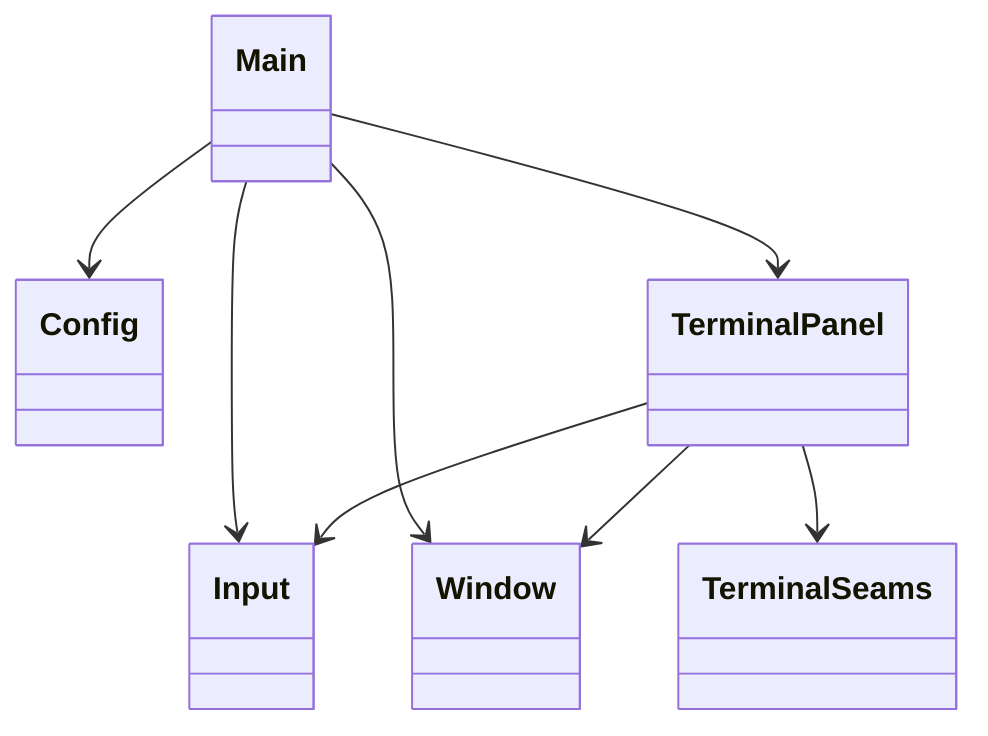
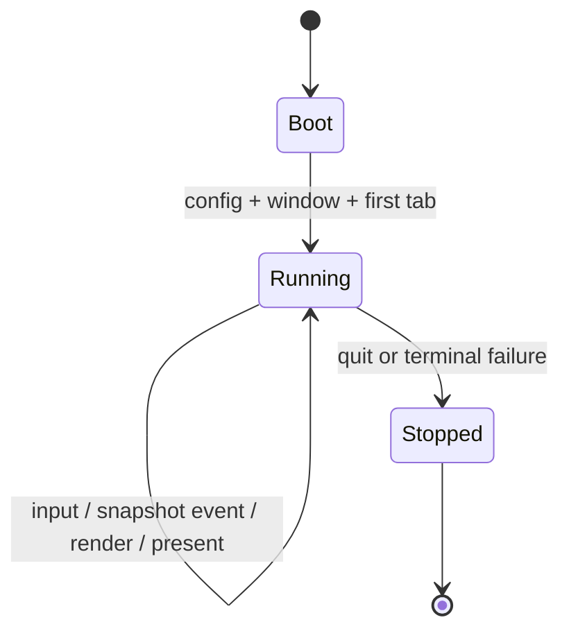
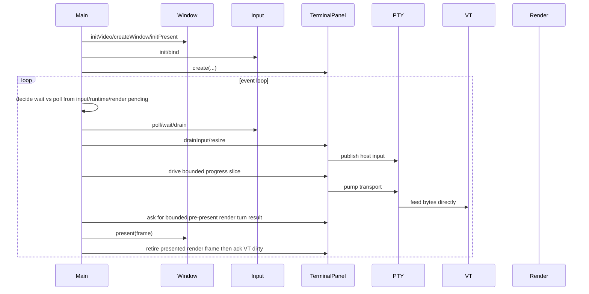

# Design

Shared rules: [`../AGENTS.md`](../AGENTS.md), [`../reference-index.md`](../reference-index.md)

## Purpose

`howl-linux-host` is the reference desktop host shell for `howl-term`.

It owns app/window/input/chrome orchestration. It does not own terminal semantics, scrollback state, dirty state, PTY behavior, VT parsing, or rendering internals.

## Doc Set

- `design.md`: owner boundary, control spine, and public surface.
- `stress.md`: operational stress and automation commands.

## Public Surface

- `Config`: loads typed host config.
- `Input`: owns the SDL input queue and exposes typed input/window/key binding events.
- `Window`: owns SDL window lifecycle and frame presentation.
- `TerminalPanel`: owns one host terminal panel/tab boundary.
- `src/terminal/`: owns the host term owner plus the PTY, VT, render, and runtime seam owners used by the panel.

## Ownership Rules

- `main.zig` owns app entry, app-owned config, tab list lifecycle, event-loop orchestration, and window presentation cadence.
- `src/terminal/terminal_panel.zig` owns one terminal instance: input translation, focus, scrollbar interaction, tab label snapshot, overlay state, per-instance term state, wake-thread state, PTY/VT progress turns, and the bounded publish/prepare/upload/submit/retire flow for its render surface.
- `src/terminal/pty/` owns PTY transport calls and child/session lifecycle at the host seam.
- `howl-linux-host` owns child environment policy for launched terminal processes, including terminal
  capability advertisement such as `TERM`. PTY transport inherits that policy; it does not invent
  shell prompt or terminal capability environment state itself.
- `src/terminal/vt/abi.zig` owns VT C ABI call translation only.
- `src/terminal/vt/retained.zig` owns host-retained VT state such as title, scrollback offset, and VT byte scratch.
- `src/terminal/vt/surface.zig` owns explicit VT-visible meta queries, direct VT copy into a render-owned
  publish slot typed as VT ABI cells/cursor, VT source publication, and VT snapshot acknowledgment after
  render retirement.
- `src/terminal/host/input.zig` owns host-input publication through VT encoding plus PTY handoff.
- `src/terminal/render/` owns render ABI calls, render-layout requests from host pixel constraints,
  and host-side render retained state. `src/terminal/render/abi.zig` translates host geometry,
  font, metric, and pixel-space calls only. `src/terminal/render/retained.zig` owns host-side render retained state and render lifecycle
  mutation: frame-layout mirror, geometry epoch, prepared-surface handle lifetime,
  and prepared-upload snapshots. Font path ownership and
  fallback-path copies belong to `howl-render`; host render code does not mirror them as retained
  state, and it does not own host term-texture state outside the active upload/submit handoff.
- `howl-linux-host` owns explicit font override resolution plus bundled fallback-stack assembly
  before render startup. It passes render one ordered font-path list through the render C ABI;
  render does not discover fonts on the host's behalf.
- `src/terminal/runtime/progress.zig` owns one bounded PTY/VT progress turn, including PTY-read slices, VT feed, and VT reply handoff.
- `src/terminal/runtime/thread.zig` owns the background wait-only wake thread for PTY readiness. It waits in bounded slices, and it does not own PTY pumping, VT mutation, or render work.
- Host shutdown wakes that thread through the PTY-owner ABI seam before join; it does not tear down transport just to break `wait_readable`.
- `main.zig` drives one bounded host turn, asks the active `TerminalPanel` whether it needs progress or render work, and performs the actual `Window.present(...)` call when chrome or the active panel requires presentation.
- `main.zig` also owns process-global child environment policy such as `TERM`, because that state is process-global on the current PTY launch path.
- The background progress thread only waits for PTY readiness and wakes the owner thread. It does not pump transport, apply VT work, or mutate render state.
- `Window` owns the OS window and host chrome presentation. It receives a term-texture handle; it does not infer terminal state.
- `Input` owns input collection and queueing. It drains one bounded SDL event burst per host turn. Input payload types live under `src/input/`.
- Hosts send events to PTY-facing owners, ask render to derive layout from render and grid pixel
  constraints, resize PTY and VT from that render-owned layout, reserve a render-owned publish slot,
  fill that slot directly from VT visible truth, commit it into the render owner through the render-
  owned VT seam, or reject that reserved publish through the render-owned failure seam, upload the
  render-owned prepared buffer into host graphics resources as one complete realized surface image,
  submit render-surface execution input using the host-owned
  term-texture through render-owned prepared handles, present that term-texture, and then
  acknowledge the rendered VT dirty generation.
  They do not invent cell geometry, mutate scrollback, mutate VT dirty state, reconstruct content
  from render damage, or own render composition rules.

## Lifecycle

## Main Flow

## API Contracts

- `TerminalPanel.create` allocates one terminal panel and hides panel-state field construction from `main.zig`.
- `TerminalPanel.destroy` is the matching lifetime close; app code must not manually deinit seam internals.
- `TerminalPanel` owns the per-instance term-texture handle used for render upload/submit, but it does not own `Window.present(...)` or host chrome composition policy.
- PTY, VT, and render seam owners are failure-aware. Recoverable backend failures return `false` or error unions and move lifecycle state to `failed`; host code should not panic from normal render or wake failure paths.
- `Window.present` draws static host chrome and places the active term-texture. It owns platform presentation only; it does not own terminal logic or render composition semantics.
- VT dirty retirement is tied to rendered-frame retirement. After `Window.present(...)`, the host performs one render retire call, receives the VT `snapshot_seq` from render-owned present state, and then routes that acknowledgment back through `src/terminal/vt/surface.zig`.

## Non-Goals

- Android lifecycle/userland behavior.
- VT parsing semantics.
- PTY internals.
- Renderer dirty tracking.
- Scrollback mutation outside `howl-term`.
