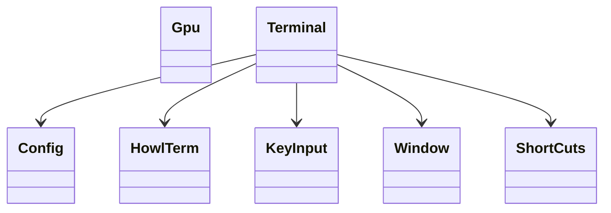
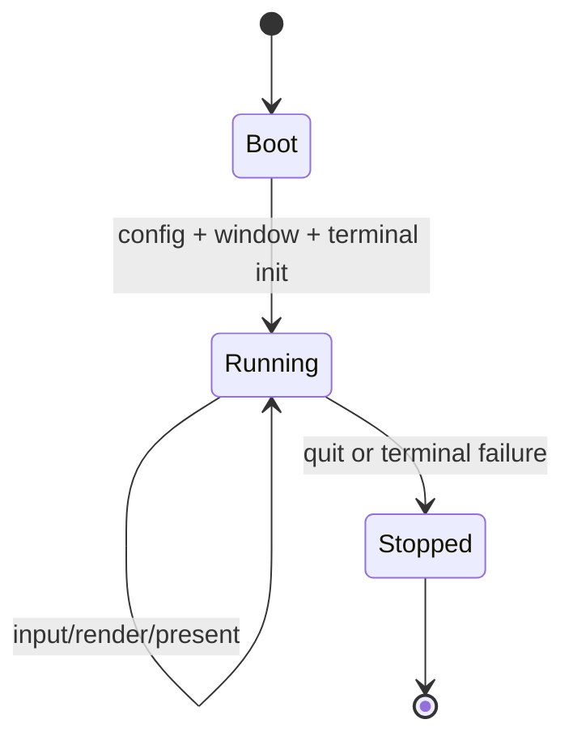
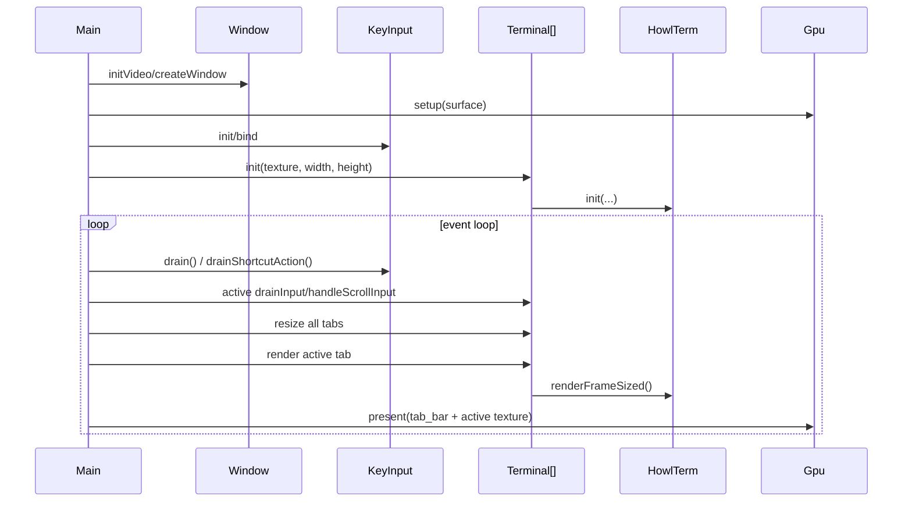

# Design

Shared rules: [`../../design/design-rules.md`](../../design/design-rules.md)

## Purpose
`howl-linux-host` owns desktop host wiring for config, windowing, input, GPU setup, and terminal presentation.

It should stay a host shell around `howl-term`, not absorb terminal semantics.

For tabbed Linux-host POCs, one `Terminal` widget represents one terminal tab. Host chrome, tab lifecycle, and multi-widget orchestration live in `main.zig`.

## Public Surface
- `Config`: host config owner.
- `Window`: window/event owner.
- `KeyInput`: input owner.
- `ShortCuts`: host shortcut-to-action owner.
- `Gpu`: GPU owner.
- `HowlTerm`: host-local terminal runtime owner.
- `Terminal`: one terminal widget/tab owner.

## Ownership Rules
- `main.zig` owns app entry, the app-owned Lua config instance, host chrome, tab/widget lifecycle, and event-loop orchestration.
- `Terminal` owns one terminal widget/tab boundary only.
- `HowlTerm` owns the embedded terminal runtime contract toward the host.
- `Window`, `KeyInput`, and `Gpu` own platform-variant selection and forwarding.
- `ShortCuts` owns stable host shortcut actions and key-resolution policy.

## Lifecycle

## Main Flows

## API Contracts
- `Config.loadLua` returns an app-owned Lua state loaded from host config.
- `Config.loadFromLua` builds owned typed config sections from an app-owned Lua state.
- `Terminal.init` starts one embedded terminal runtime with a renderer-owned retained surface consumed by the host compositor.
- `HowlTerm.init` owns transport creation and delegates to core `howl-term`.
- `Window` and `KeyInput` abstract backend selection behind stable host owners.
- `ShortCuts` resolves host key chords into stable host actions without re-parsing terminal byte input.

## Host Register Scope
The host contract should stay split into three independent concerns:

- render/publication wake:
  - redraw ready
  - present ack
  - publication/generation state
- host -> core command register:
  - stable typed runtime controls
  - examples in the current POC:
    - font zoom in/out/reset
    - terminal new/close/next/prev/focus-tab shortcuts
- core -> host event register:
  - stable host-facing terminal/runtime events
  - owned below the host shell, likely in `howl-session`
  - not mixed into redraw wake

The Linux host POC implemented here only exercises the host -> core side directly. It intentionally leaves the core -> host event register as documented future work.

## Register Growth Rules
When adding stable host-facing events later:

- add only durable host UX concepts, not raw protocol names
- prefer one stable event kind per host meaning
- normalize multiple protocol sources into one event where possible
- keep redraw/publication wake separate from host UX events
- document producer, payload, and host opt-in policy alongside the new event

Examples of likely future stable core -> host events:

- `title_changed`
- `cwd_changed`
- `clipboard_write_requested`
- `child_exit`
- `command_state_changed`
- `notification_requested`

Examples of likely future host -> core commands:

- `set_font_size`
- `adjust_font_size`
- `reset_font_size`
- `set_theme`
- `cycle_theme`

## Non-Goals
- VT parsing semantics.
- PTY implementation details.
- Shared render contract design.

## Change Rules
- New platform variants should extend `Window`, `KeyInput`, or `Gpu`, not leak through `main.zig`.
- Hosts should keep terminal semantics delegated to `howl-term` and `vt-core`.
- New host chrome features should be orchestrated from `main.zig` unless they are purely local to one `Terminal` widget/tab.
