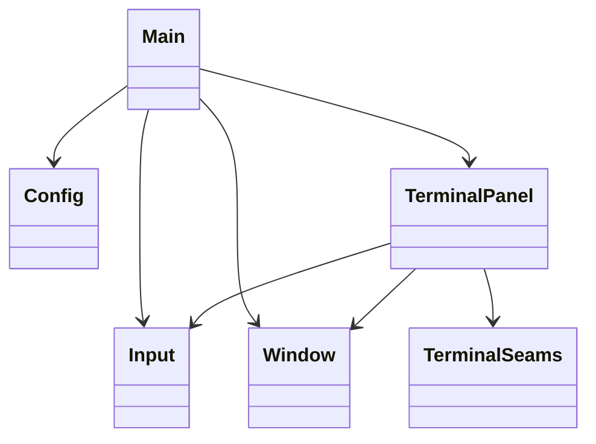
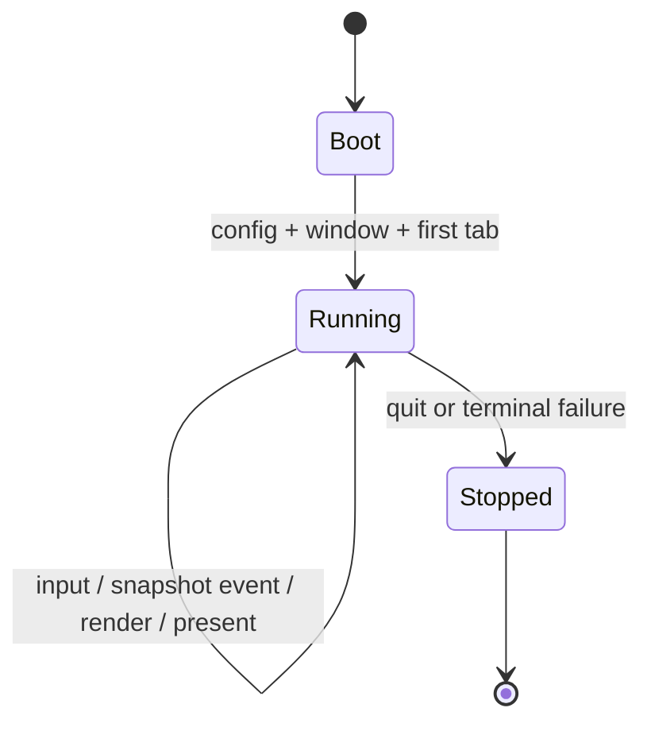
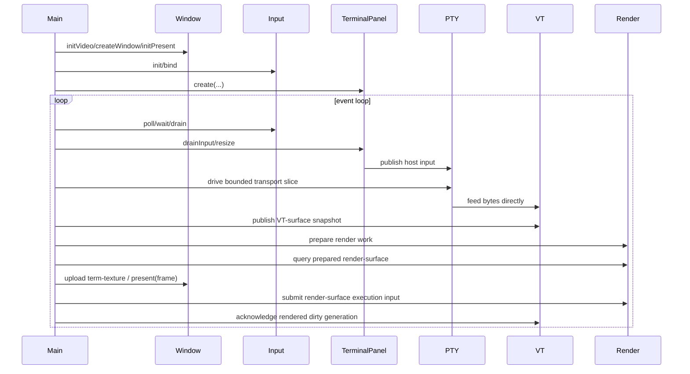

# Design

Shared rules: [`../../design/design-rules.md`](../../design/design-rules.md)

## Purpose

`howl-linux-host` is the reference desktop host shell for `howl-term`.

It owns app/window/input/chrome orchestration. It does not own terminal semantics, scrollback state, dirty state, PTY behavior, VT parsing, or rendering internals.

## Doc Set

- `design.md`: owner boundary, control spine, and public surface.
- `stress.md`: operational stress and automation commands.

## Public Surface

- `Config`: loads typed host config.
- `Input`: owns the SDL input queue and exposes typed input/window/key binding events.
- `Window`: owns SDL window lifecycle, clipboard/URL helpers, and frame presentation.
- `TerminalPanel`: owns one host terminal panel/tab boundary.
- `src/terminal/`: owns the PTY, VT, render, and runtime seam owners used by the panel.

## Ownership Rules

- `main.zig` owns app entry, app-owned config, tab lifecycle, event-loop orchestration, and per-tab term-texture ownership.
- `src/terminal/terminal_panel.zig` owns one terminal panel boundary: input translation, focus, scrollbar interaction, tab label snapshot, and terminal runtime lifetime. It does not own host term-texture state or GL upload.
- `src/terminal/pty/` owns PTY transport calls and child/session lifecycle at the host seam.
- `howl-linux-host` owns child environment policy for launched terminal processes, including terminal
  capability advertisement such as `TERM`. PTY transport inherits that policy; it does not invent
  shell prompt or terminal capability environment state itself.
- `src/terminal/vt/abi.zig` owns VT C ABI call translation only.
- `src/terminal/vt/retained.zig` owns host-retained VT state such as title, scrollback offset, snapshot sequence, and VT byte scratch.
- `src/terminal/vt/surface.zig` owns VT surface copy and VT snapshot publication.
- `src/terminal/host/input.zig` owns host-input publication through VT encoding plus PTY handoff.
- `src/terminal/render/` owns render ABI calls, render-layout requests from host pixel constraints,
  frame layout sync, prepared-surface drive, and contract translation between VT-surface input and
  render-surface output. Retained render queue state, geometry epoch/query state, VT snapshot
  publication classification, submit validation, and present retirement belong to `howl-render`;
  the host consumes those steps through the render C ABI. `src/terminal/render/retained.zig` owns
  host-side render retained state: frame-layout mirror, prepared-surface handle lifetime, and
  accumulated render perf counters. Font path ownership and fallback-path copies belong to
  `howl-render`; host render code does not mirror them as retained state, and it does not own host
  term-texture state.
- `src/terminal/runtime/` owns the shared runtime aggregate state and the bounded host control spine that drives PTY, VT, and render work, including PTY-read slices, VT feed, and VT reply handoff.
- `main.zig` drives one bounded PTY transport slice with direct VT feed, and one explicit in-flight render-work query per turn when deciding whether to wait, render, present, or wake again. It also owns per-tab term-texture creation, upload, submit execution input, and present acknowledgment.
- The background progress thread only waits for PTY readiness and wakes the owner thread. It does not pump transport, apply VT work, or mutate render state.
- `Window` owns the OS window and host chrome presentation. It receives a term-texture handle; it does not infer terminal state.
- `Input` owns input collection and queueing. Input payload types live under `src/input/`.
- Hosts send events to PTY-facing owners, ask render to derive layout from render and grid pixel
  constraints, resize PTY and VT from that render-owned layout, publish VT snapshot metadata into
  the render owner, upload the render-owned prepared buffer into host graphics resources as one
  complete realized surface image, submit render-surface execution input using the host-owned
  term-texture, present that term-texture, and then acknowledge the rendered VT dirty generation.
  They do not invent cell geometry, mutate scrollback, mutate VT dirty state, reconstruct content
  from render damage, or own render composition rules.

## Lifecycle

## Main Flow

## API Contracts

- `TerminalPanel.create` starts one terminal panel and hides seam-owner field construction from `main.zig`.
- `TerminalPanel.destroy` is the matching lifetime close; app code must not manually deinit seam internals.
- `TerminalPanel` does not own or export concrete backend resources.
- `main.zig` owns per-tab term-texture state and uses the terminal/render ABIs to prepare, upload, submit, present, and acknowledge.
- PTY, VT, and render seam owners are failure-aware. Recoverable backend failures return `false` or error unions and move lifecycle state to `failed`; host code should not panic from normal render or wake failure paths.
- `Window.present` draws static host chrome and places the active term-texture. It owns platform presentation only; it does not own terminal logic or render composition semantics.
- VT dirty retirement is tied to the rendered base. The host acknowledges the dirty generation reported by the published VT surface only after present.

## Non-Goals

- Android lifecycle/userland behavior.
- VT parsing semantics.
- PTY internals.
- Renderer dirty tracking.
- Scrollback mutation outside `howl-term`.
