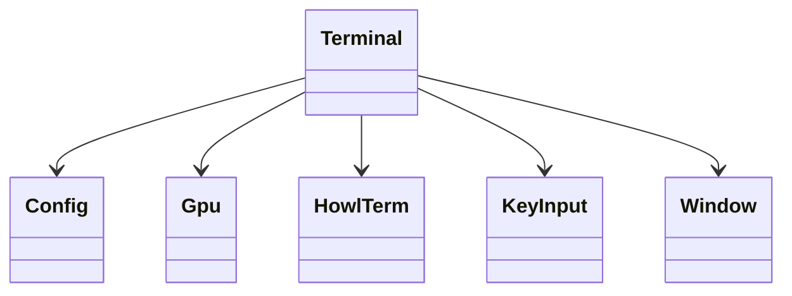
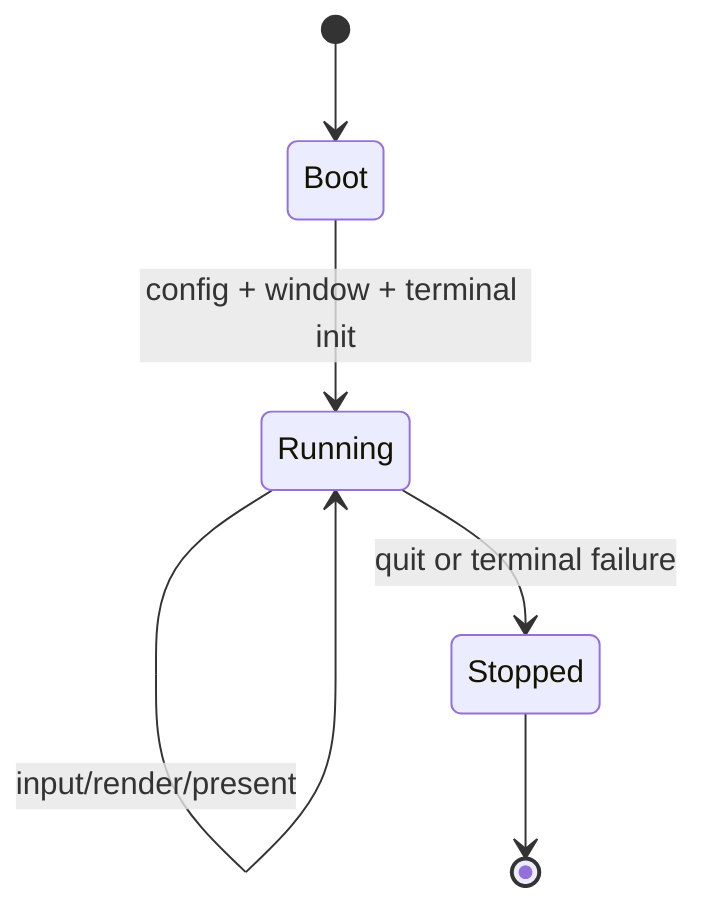
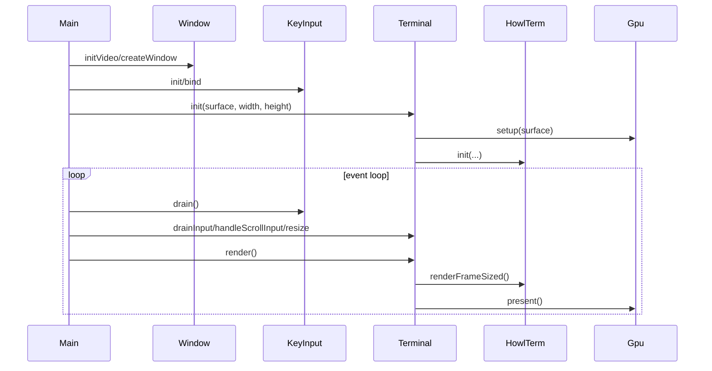

# Design

Shared rules: [`../../design/design-rules.md`](../../design/design-rules.md)

## Purpose
`howl-linux-host` owns desktop host wiring for config, windowing, input, GPU setup, and terminal presentation.

It should stay a host shell around `howl-term`, not absorb terminal semantics.

## Public Surface
- `Config`: host config owner.
- `Window`: window/event owner.
- `KeyInput`: input owner.
- `Gpu`: GPU owner.
- `HowlTerm`: host-local terminal runtime owner.
- `Terminal`: top-level terminal widget/runtime owner.

## Ownership Rules
- `main.zig` owns app entry and event-loop orchestration only.
- `Terminal` owns the host terminal presentation boundary.
- `HowlTerm` owns the embedded terminal runtime contract toward the host.
- `Window`, `KeyInput`, and `Gpu` own platform-variant selection and forwarding.

## Lifecycle

## Main Flows

## API Contracts
- `Config.load` returns owned config data that callers must `deinit`.
- `Terminal.init` sets up GPU state and starts the embedded terminal runtime.
- `HowlTerm.init` owns transport creation and delegates to core `howl-term`.
- `Window` and `KeyInput` abstract backend selection behind stable host owners.

## Non-Goals
- VT parsing semantics.
- PTY implementation details.
- Shared render contract design.

## Change Rules
- New platform variants should extend `Window`, `KeyInput`, or `Gpu`, not leak through `main.zig`.
- Hosts should keep terminal semantics delegated to `howl-term` and `vt-core`.
