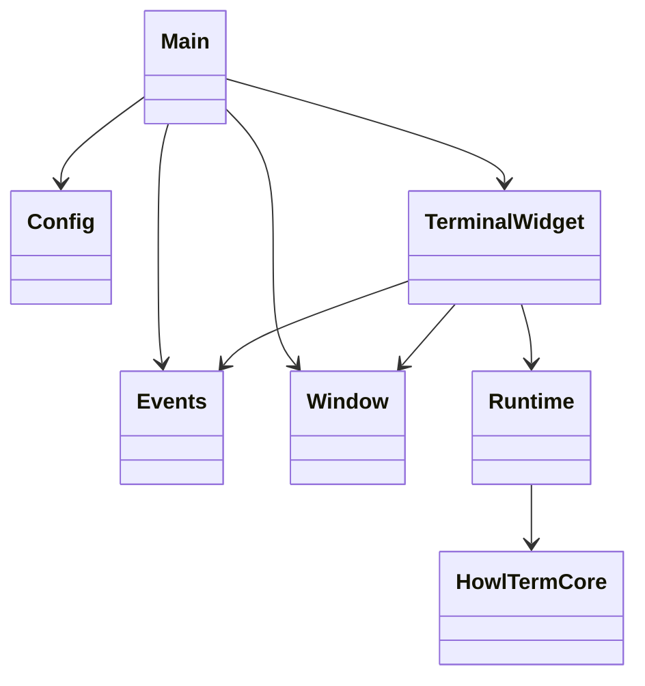
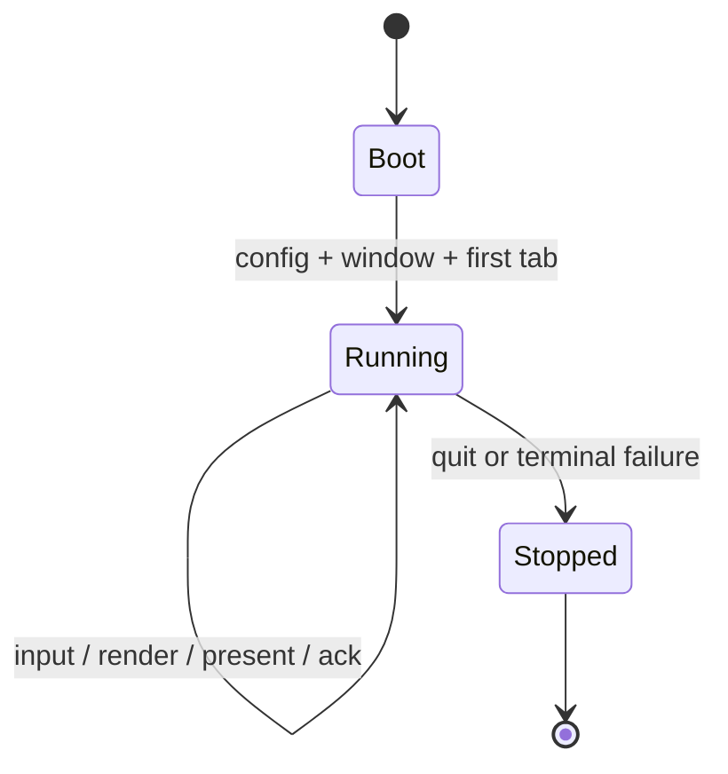
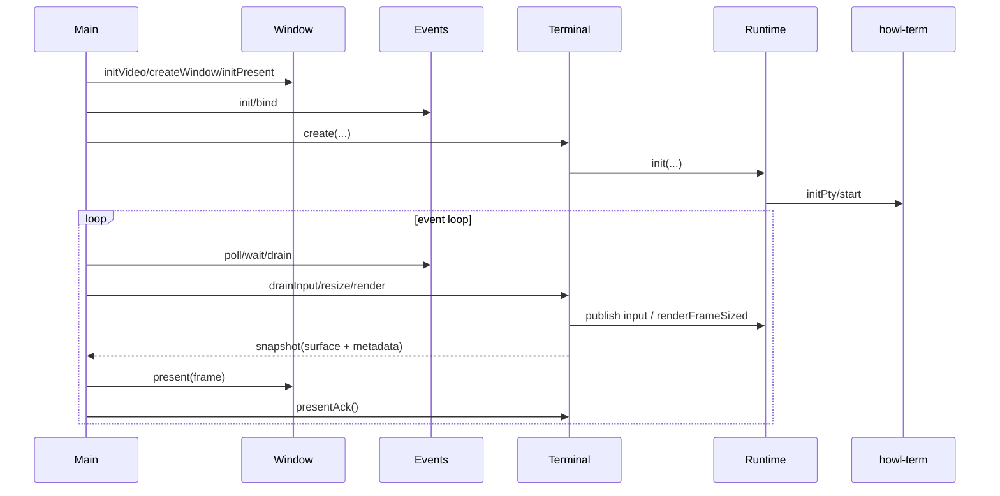

# Design

Shared rules: [`../../design/design-rules.md`](../../design/design-rules.md)

## Purpose

`howl-linux-host` is the reference desktop host shell for Howl.

It owns app/window/input/chrome orchestration. It does not own terminal semantics, scrollback state, dirty state, PTY behavior, VT parsing, or rendering internals.

## Public Surface

- `Config`: loads typed host config.
- `Events`: owns the SDL event queue and exposes typed input/window/shortcut events.
- `Window`: owns SDL window lifecycle, clipboard/URL helpers, and frame presentation.
- `Terminal`: owns one host terminal widget/tab.
- `howl-term/Runtime`: owns the host handoff to the imported `howl-term` package.

## Ownership Rules

- `main.zig` owns app entry, app-owned config, tab lifecycle, and event-loop orchestration.
- `src/widget/terminal.zig` owns one terminal widget boundary: input translation, widget focus, scrollbar interaction, tab label snapshot, and terminal runtime lifetime.
- `src/howl-term/howl_term.zig` owns the host-local runtime facade over the imported `howl-term` package.
- `Window` owns the OS window and host chrome presentation. It receives a texture handle; it does not infer terminal state.
- `Events` owns event collection and queueing. Event payload types live under `src/events/`.
- Hosts send events, request wakes, present returned surfaces, and acknowledge presentation. They do not mutate scrollback or render dirty state.

## Lifecycle

## Main Flow

## API Contracts

- `Terminal.create` starts one terminal widget and hides runtime field construction from `main.zig`.
- `Terminal.destroy` is the matching lifetime close; app code must not manually deinit widget internals.
- `Terminal.snapshot` returns host chrome metadata and the current backend surface handle.
- `Runtime` is failure-aware. Recoverable backend failures return `false` and move lifecycle state to `failed`; host code should not panic from normal render/wake failure paths.
- `Window.present` draws static host chrome and places the active terminal surface. It does not own terminal logic.

## Non-Goals

- Android lifecycle/userland behavior.
- VT parsing semantics.
- PTY internals.
- Renderer dirty tracking.
- Scrollback mutation outside `howl-term`.
