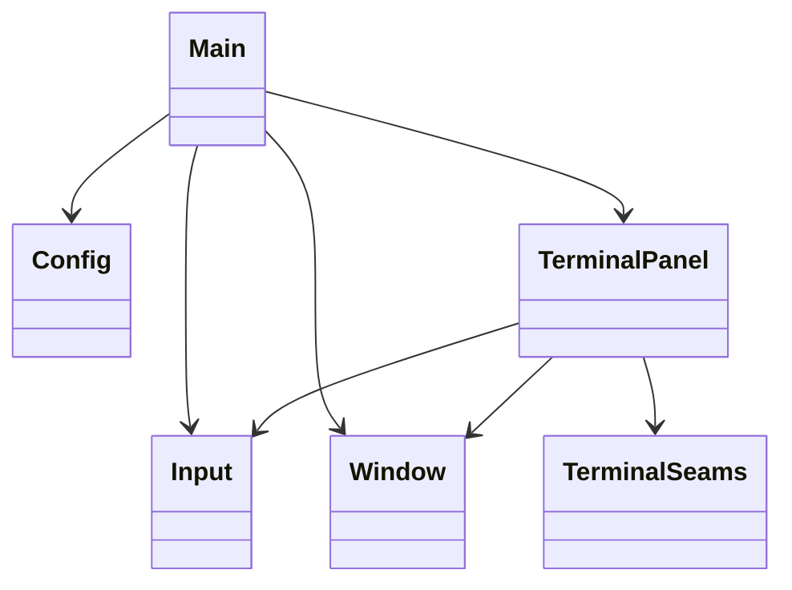
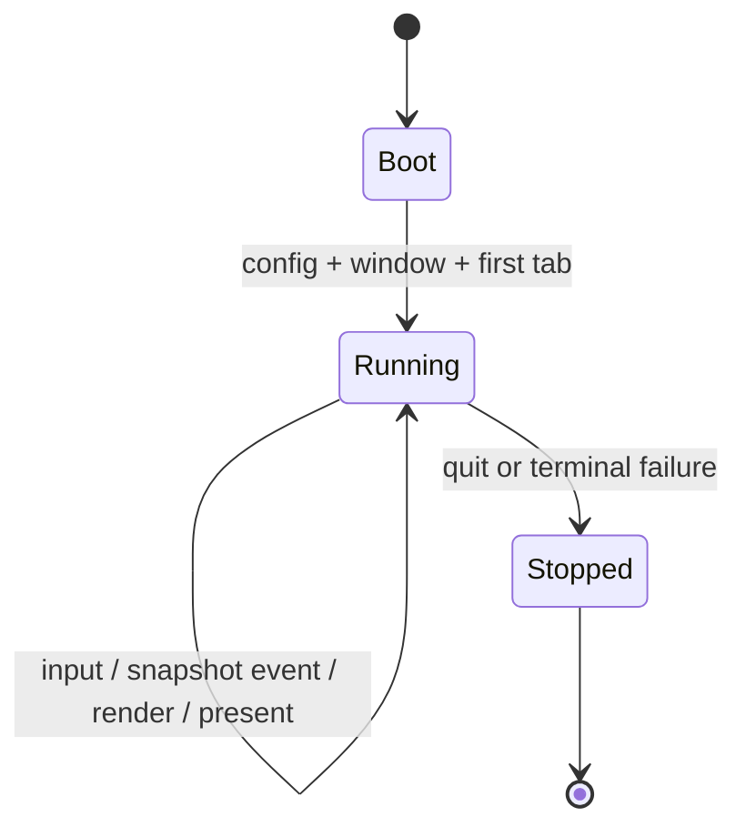
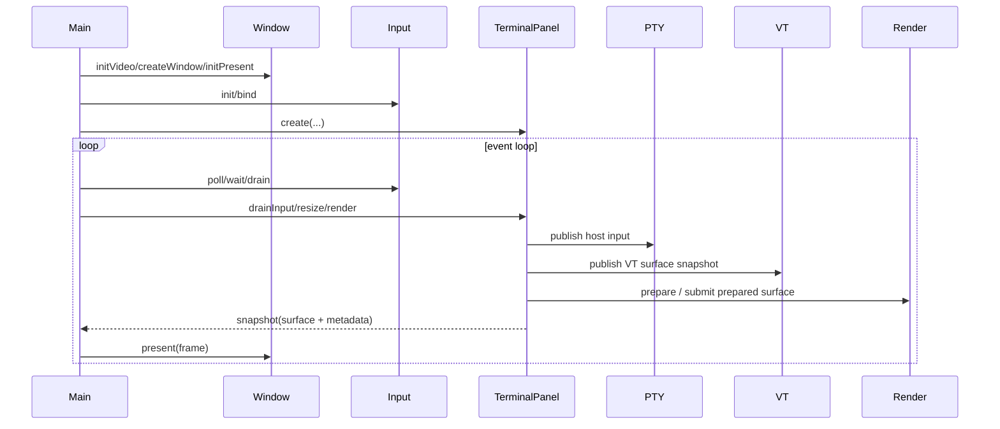

# Design

Shared rules: [`../../design/design-rules.md`](../../design/design-rules.md)

## Purpose

`howl-linux-host` is the reference desktop host shell for `howl-term`.

It owns app/window/input/chrome orchestration. It does not own terminal semantics, scrollback state, dirty state, PTY behavior, VT parsing, or rendering internals.

## Doc Set

- `design.md`: owner boundary, control spine, and public surface.
- `stress.md`: operational stress and automation commands.

## Public Surface

- `Config`: loads typed host config.
- `Input`: owns the SDL input queue and exposes typed input/window/key binding events.
- `Window`: owns SDL window lifecycle, clipboard/URL helpers, and frame presentation.
- `TerminalPanel`: owns one host terminal panel/tab boundary.
- `src/terminal/`: owns the PTY, VT, render, and runtime seam owners used by the panel.

## Ownership Rules

- `main.zig` owns app entry, app-owned config, tab lifecycle, and event-loop orchestration.
- `src/terminal/terminal_panel.zig` owns one terminal panel boundary: input translation, focus, scrollbar interaction, tab label snapshot, and terminal runtime lifetime.
- `src/terminal/pty/` owns PTY transport calls and child/session lifecycle at the host seam.
- `src/terminal/vt/` owns VT ABI calls, retained visible state, and host-side VT contract translation.
- `src/terminal/render/` owns render ABI calls, frame layout sync, prepared-surface drive, and host-side backend upload/present contract translation.
- `src/terminal/runtime/` owns the shared runtime aggregate state and the bounded host control spine that drives PTY, VT, and render work.
- `Window` owns the OS window and host chrome presentation. It receives a texture handle; it does not infer terminal state.
- `Input` owns input collection and queueing. Input payload types live under `src/input/`.
- Hosts send events to PTY-facing owners, publish one VT surface snapshot, upload the render-owned prepared buffer into host graphics resources, and present returned surfaces. They do not mutate scrollback, VT dirty state, or render composition rules.

## Lifecycle

## Main Flow

## API Contracts

- `TerminalPanel.create` starts one terminal panel and hides seam-owner field construction from `main.zig`.
- `TerminalPanel.destroy` is the matching lifetime close; app code must not manually deinit seam internals.
- `TerminalPanel.snapshot` returns host chrome metadata and the current backend surface handle.
- PTY, VT, and render seam owners are failure-aware. Recoverable backend failures return `false` or error unions and move lifecycle state to `failed`; host code should not panic from normal render or wake failure paths.
- `Window.present` draws static host chrome and places the active terminal surface. It owns platform presentation only; it does not own terminal logic or render composition semantics.

## Non-Goals

- Android lifecycle/userland behavior.
- VT parsing semantics.
- PTY internals.
- Renderer dirty tracking.
- Scrollback mutation outside `howl-term`.
